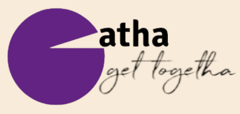
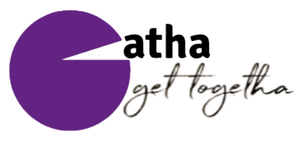
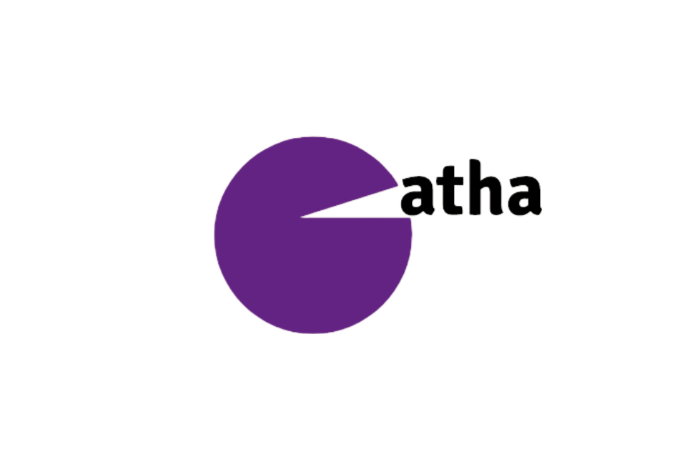

# Gatha - get togetha

MERN stack group chat application utilizing socket.io, enabling bidirectional communication between clients and the server.

  
  
  

## Project

Gatha is the final project of our Web Dev class at [DCI](https://digitalcareerinstitute.org/courses/web-development/). Our goal, as a group of 3 students within the 7-week project timeframe, was to deliver a functional chat application that our classmates could use on the day of the final presentation (December 14, 2023). We also aimed at writing DRY, clean and well-documented code.

## Technologies

## Demo

Access the application [here](https://gatha.netlify.app/). Optionally, join our public demo group by entering group code 'YAZKQGRY' from within the application.

## Team

|  |  |  |
| -------------------------------------------------------------------------------------------------------------------------------------- | ------------------------------------------------------------------------------------------------------------------------------------------------------------------------------- | ---------------------------------------------------------------------------------------------------------------------------------------- |
| [Yesim Demir](https://github.com/besincielement)                                                                                       | [Abdulwase Naeemi](https://github.com/Naeemi7)                                                                                                                                  | [Felix Schmidt](https://github.com/felixschmidt89)                                                                                       |
| Design Lead & Full-Stack Allrounder                                                                                                    | Backend & Socket.io Lead                                                                                                                                                        | Frontend Lead & Product Manager                                                                                                          |

## Key features

- Design:

  - Responsive design including distinct page structure for smartphones.
  - Two different designs based on the user's logged-in status.

- General:
  - User creation and authentication using JWT token security, with automatic logout when the token expires.
  - Group creation and management, allowing users to create groups, add other users (via sharing a human-readable group code or manually adding them), promote users to group admins, and remove non-admin users from groups.
  - Continuous synchronization of users' views and the database.
- Chat:
  - Real-time messaging with other users in a group.
  - Rendering all groups of a user and allowing seamless switching between them.
  - Sending and deleting messages, always displaying the most recent message while allowing users to browse the entire group chat history.
  - Rendering group info, including a list of group members and their admin status, and allowing users to leave the group.
  - Displaying user online status and a typing indicator.
  - Emoji picker for desktop devices.
- Development Tools:

  - Separate development deploy infrastructure (e.g., URL and database) to test on the web before pushing to production.

## License

Gatha is licensed under the MIT License.
[MIT License](https://opensource.org/license/mit/)
